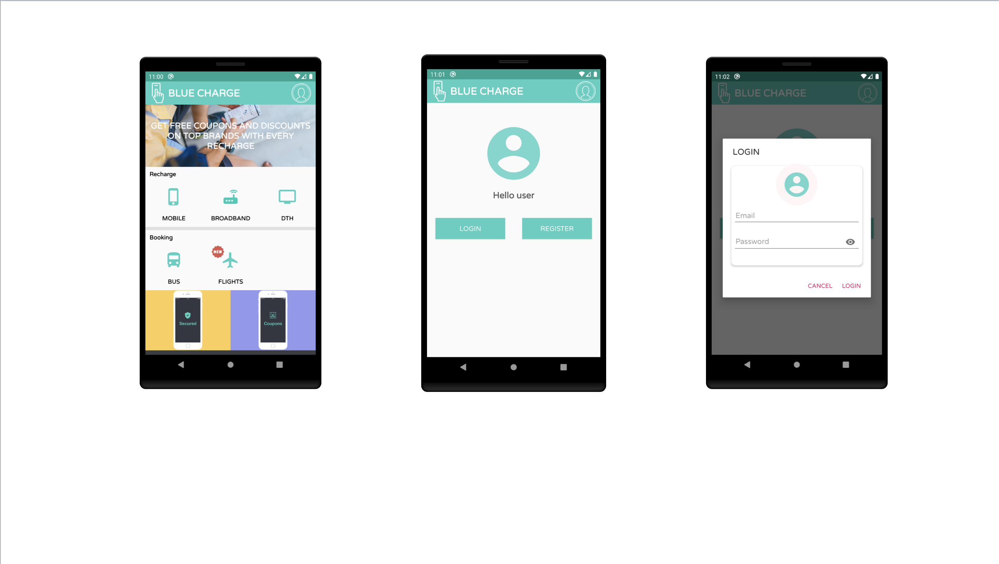

# Android Sample Application for IBM Cloud App Configuration service
> **DISCLAIMER**: This is a guideline sample application and is used for demonstrative and illustrative purposes only. This is not a production ready code.

This sample contains an Android project that you can use to learn more about the IBM Cloud App Configuration service.

## Contents
- [Android Sample Application for IBM Cloud App Configuration service](#android-sample-application-for-ibm-cloud-app-configuration-service)
  - [Contents](#contents)
  - [Prerequisite](#prerequisite)
  - [Create an instance of App Configuration service](#create-an-instance-of-app-configuration-service)
  - [Setup the App Configuration service instance](#setup-the-app-configuration-service-instance)
  - [Setup and run the android app](#setup-and-run-the-android-app)
  - [Test the app with feature toggle and segmentation](#test-the-app-with-feature-toggle-and-segmentation)
  - [Screenshots](#screenshots)
- [License](#license)

## Prerequisite

- You need an [IBM Cloud](http://cloud.ibm.com/) account. If you don't have an account, create one [here](https://cloud.ibm.com/registration/).

## Create an instance of App Configuration service
- Log in to your IBM Cloud account.
- In the [IBM Cloud catalog](https://cloud.ibm.com/catalog#services), search **App Configuration** and click [App Configuration](https://cloud.ibm.com/catalog/services/app-configuration). The service provisioning page opens.
- **Select a region** - Currently, Dallas (us-south), London (eu-gb) and Sydney (au-syd) regions are supported.
- Select a pricing plan, resource group and configure your resource with a service name, or use the preset name.
- Click **Create**. A new service instance is created and the App Configuration dashboard is displayed.

## Setup the App Configuration service instance
- Download the source code
    ```
    git clone https://github.com/IBM/appconfiguration-samples.git
    cd appconfiguration-samples/android-java
    ```
- Install `jq` - command-line JSON processor.
    - You can install it from [here](https://stedolan.github.io/jq/download/)
- Go to dashboard of your App Configuration instance in IBM Cloud UI.
- Navigate to Service Credentials section and generate a new set of credentials. Note down the `region`, `guid` and `apikey`. These credentials are required in the next steps.
- From your terminal, execute the [demo-android.sh](../common/script/demo-android.sh) script by running below command
    ```bash
    $ cd appconfiguration-samples/common/script
    $ ./demo-android.sh
    ```
    > If any permission error occurred during script the execution, provide appropriate permission by running - `sudo chmod 777 ./demo-android.sh`. And then execute the script.  
- Provide all the inputs during script execution. A sample example is shown in below figure
  
- Script execution takes time. Script is executed successfully only when you see the log `---Demo script complete---` at the end in your terminal.
- This script will create the collections, feature flags, properties & segments using the default dev environment in the instance which are required for the sample android app

## Setup and run the android app
- Import App Configuration client SDK
Use either of the following options
    - [Download](https://github.com/IBM/appconfiguration-android-client-sdk) and import the package to your Android studio project
        - Go to `File-->New-->Import Module` and provide the path of downloaded SDK
        - Then add `implementation project(path: ':lib')` in the module level `build.gradle` file dependencies.
    - Get the package through Gradle by adding the following
        - Add below dependencies to module level `build.gradle` file
        ```java 
            dependencies {
               implementation "com.ibm.cloud:appconfiguration-android-sdk:0.2.0"
            }
         ```

- Edit the android app
    - In file `SplashActivity.java` at [line 43 & 44](app/src/main/java/com/ibm/appconfiguration/example/bluecharge/SplashActivity.java#L43) provide the `apikey` and `guid` with the values you obtained from the Service credentials section of the instance.
    - And at [line 50](app/src/main/java/com/ibm/appconfiguration/example/bluecharge/SplashActivity.java#L50) provide the `region` parameter as
        - `AppConfiguration.REGION_EU_GB` for London
        - `AppConfiguration.REGION_US_SOUTH` for Dallas
        - `AppConfiguration.REGION_AU_SYD` for Sydney
    - Provide `collectionId` as `blue-charge-android` & `environmentId`(default value is `dev`) at [line 51](app/src/main/java/com/ibm/appconfiguration/example/bluecharge/SplashActivity.java#L51).

- Run the app

## Test the app with feature toggle and segmentation
- On the homeactivity click on profile icon. Signup and create various users with different email ids.
- Additionally, register/create two users with email id alice@bluecharge.com & bob@bluecharge.com
- From the App Configuration service instance dashboard, navigate to Feature flags section.
- Turn ON the toggle for `Floating Profile` feature flag. Once turned ON, close & re-open the bluecharge android app. You would observe that user profile icon from the homeactivity toolbar is now displayed as a floating icon located bottom right of the homeactivity. And when the toggle is turned OFF the user profile icon is positioned back in the toolbar menu when the app is re-opened again.
- Similarly, turn ON the toggle for 'Flight Booking' feature flag. Now re-open and login with either of alice@bluecharge.com or bob@bluecharge.com email id. Once logged in, you would see a Flight Booking button on homeactivity. If you try logging in with email ids other than alice & bob you'll not see the Flight Booking button, because alice & bob are a part of `Software testers` segment and the Flight Booking feature is enabled only for `Software testers` segment.
- Another use case is with numeric property called `Flight Booking Discount`. Navigate to Properties section on the App Configuration service instance dashboard to view this property. This property holds the discount value(of 5).
- Re-open the app and navigate to flightactivity by clicking on Flight Booking button. You will see cardview discount coupon of 5% value. The discount will be 25% for user logging in with email id ending with `ibm.com` and it defaults to 5% for all other users, because users whose email is ending with `ibm.com` are part of `IBM employees segment`.
## Screenshots

# License
This project is released under the Apache 2.0 license. The license's full text can be found in [LICENSE](LICENSE)

See [here](https://cloud.ibm.com/docs/app-configuration) for detailed docs on App Configuration service.
